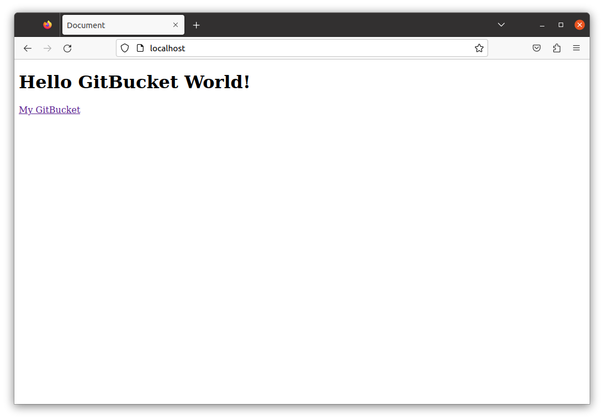
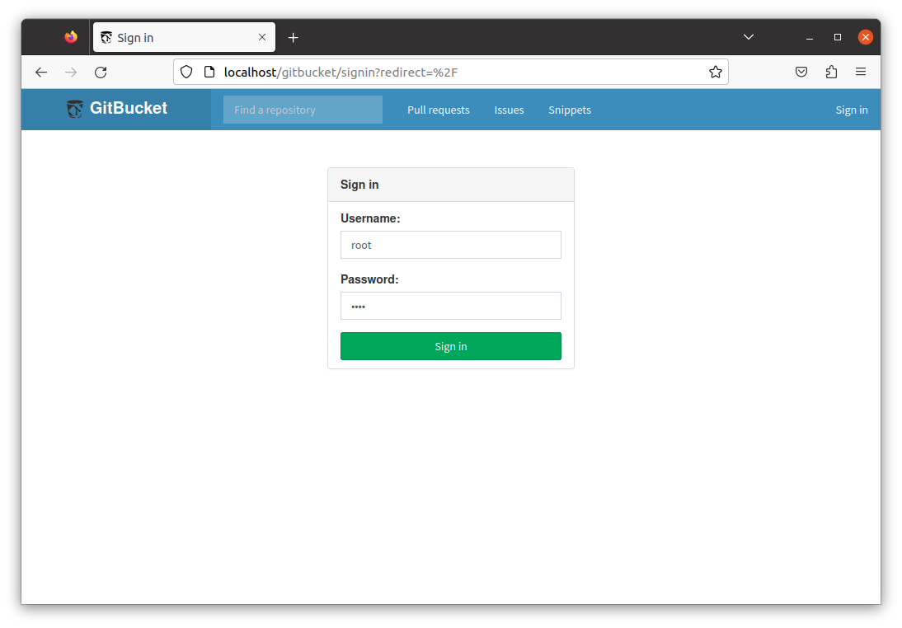
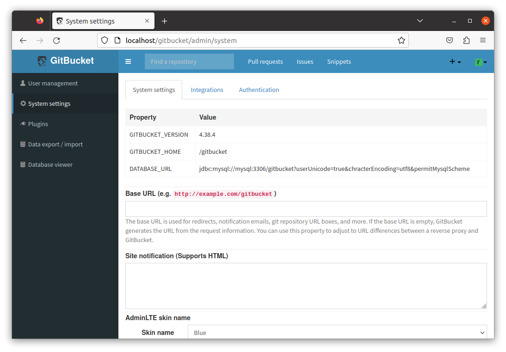

# GitBucket + MySQL + Nginx Reverse Proxy

Here I use docker compose to set up the GitBucket server.
And use MySQL sever for GitBucket's DB, and also use a Nginx reverse proxy and publish to the /gitbucket path.

# How to use

* clone this repository
* create two files
    * ./.env  
        Copy .env.sample to create .env file. Set the user name and password for the DB for GitBucket to will be created in MySQL and the user name and password for MySQL in the .env file.
    * mysql/.secret  
        Copy .sectre.sample to create .secret file. Set the root password for MySQL in the .secret file.
* build containers
    ```
    $ docker compose build
    [+] Building 3.0s (14/14) FINISHED                                                                                                   
    => [gitbucket internal] load build definition from Dockerfile                                                                  0.1s
    => => transferring dockerfile: 343B                                                                                            0.0s
    => [gitbucket internal] load .dockerignore                                                                                     0.2s
    => => transferring context: 2B                                                                                                 0.0s
    => [gitbucket internal] load metadata for docker.io/library/eclipse-temurin:8-jdk-focal                                        0.0s
    => [gitbucket] https://github.com/gitbucket/gitbucket/releases/download/4.38.4/gitbucket.war                                   0.7s
    => [gitbucket 1/3] FROM docker.io/library/eclipse-temurin:8-jdk-focal                                                          0.0s
    => CACHED [gitbucket 2/3] ADD https://github.com/gitbucket/gitbucket/releases/download/4.38.4/gitbucket.war /opt/gitbucket.wa  0.0s
    => CACHED [gitbucket 3/3] RUN ln -s /gitbucket /root/.gitbucket                                                                0.0s
    => [gitbucket] exporting to image                                                                                              0.0s
    => => exporting layers                                                                                                         0.0s
    => => writing image sha256:714ea0b92751441cdd19eb57d27a70feea2be8d695b01652db3042f215429b66                                    0.0s
    => => naming to docker.io/library/gitbucket3-gitbucket                                                                         0.0s
    => [nginx internal] load .dockerignore                                                                                         0.3s
    => => transferring context: 2B                                                                                                 0.0s
    => [nginx internal] load build definition from Dockerfile                                                                      0.4s
    => => transferring dockerfile: 158B                                                                                            0.0s
    => [nginx internal] load metadata for docker.io/library/nginx:1.23.4                                                           0.0s
    => [nginx 1/2] FROM docker.io/library/nginx:1.23.4                                                                             0.0s
    => CACHED [nginx 2/2] RUN echo "Asia/Tokyo" > /etc/timezone     && dpkg-reconfigure -f noninteractive tzdata                   0.0s
    => [nginx] exporting to image                                                                                                  0.3s
    => => exporting layers                                                                                                         0.0s
    => => writing image sha256:640fbcef717d3479ba56e2465929a849464df177a6b99533afdb3679846e2c32                                    0.3s
    => => naming to docker.io/library/gitbucket3-nginx                                                                             0.0s
* Run the mysql container first. Then, check the log and wait until the mysql server starts.
    ```
    $ docker compose up -d mysql
    [+] Building 0.0s (0/0)                                                                                                              
    [+] Running 2/2
    ✔ Network gitbucket3_default  Created                                                                                          0.1s 
    ✔ Container gb-mysql          Started                                                                                          1.3s 
    $ docker compose logs mysql
    gb-mysql  | 2023-06-10 08:10:05+09:00 [Note] [Entrypoint]: Entrypoint script for MySQL Server 8.0.32-1.el8 started.
    ...
    gb-mysql  | 2023-06-09T23:10:56.379661Z 0 [System] [MY-010931] [Server] /usr/sbin/mysqld: ready for connections. Version: '8.0.32'  socket: '/var/run/mysqld/mysqld.sock'  port: 3306  MySQL Community Server - GPL.
    ```
* Next, run the gitbucket contaner. Check the log in the same way and confirm that the gitbucket server has started.
    ```
    $ docker compose up -d gitbucket
    [+] Building 0.0s (0/0)                                                                                                              
    [+] Running 2/2
    ✔ Container gb-mysql   Running                                                                                                 0.0s 
    ✔ Container gitbucket  Started                                                                                                 1.1s 
    $ docker compose logs gitbucket
    gitbucket  | 2023-06-10 08:11:15.054:INFO::main: Logging initialized @134ms to org.eclipse.jetty.util.log.StdErrLog
    ...
    gitbucket  | 08:11:16.901 [main] INFO  g.core.servlet.InitializeListener - Check version
    gitbucket  | 08:11:16.901 [main] INFO  g.core.servlet.InitializeListener - Start schema update

    ```
* Finally, run the nginx container and confirm that the nginx server has started.
    ```
    $ docker compose up -d nginx
    [+] Building 0.0s (0/0)                                                                                                              
    [+] Running 3/3
    ✔ Container gb-mysql   Running                                                                                                 0.0s 
    ✔ Container gitbucket  Running                                                                                                 0.0s 
    ✔ Container gb-nginx   Started                                                                                                 2.7s 
    $ docker compose logs nginx
    gb-nginx  | /docker-entrypoint.sh: /docker-entrypoint.d/ is not empty, will attempt to perform configuration
    ...
    gb-nginx  | /docker-entrypoint.sh: Launching /docker-entrypoint.d/30-tune-worker-processes.sh
    gb-nginx  | /docker-entrypoint.sh: Configuration complete; ready for start up
    ```
* If the three containers are successfully started, the following message is displayed.
    ```
    $ docker compose ps
    NAME                IMAGE                  COMMAND                  SERVICE             CREATED              STATUS              PORTS
    gb-mysql            mysql:8.0.32           "docker-entrypoint.s…"   mysql               2 minutes ago        Up 2 minutes        33060/tcp, 0.0.0.0:32780->3306/tcp, :::32780->3306/tcp
    gb-nginx            gitbucket3-nginx       "/docker-entrypoint.…"   nginx               23 seconds ago       Up 20 seconds       0.0.0.0:80->80/tcp, :::80->80/tcp
    gitbucket           gitbucket3-gitbucket   "sh -c 'java -jar /o…"   gitbucket           About a minute ago   Up About a minute   0.0.0.0:32782->8080/tcp, :::32782->8080/tcp, 0.0.0.0:32781->29418/tcp, :::32781->29418/tcp
    ```
* Add plugins  
    To add a plugin, obtain the plugin jar file from the provider and place it in gitbucket/data/plugins.
    ```
    $ sudo cp (plugin filename).jar gitbucket/data/plugins/
    ```
* Confirm the operation
    * If you open http://localhost in your browser, you will see the following.
        
    * Click on the My GitBucket link, and the GitBucket sign-in screen will appear.
        
    * Sign in with the initial user name `root` and initial password `root`, and you will see the following.
        
    * Select the System Settings menu, and confirm that the Property column appears as follows.
        

# Reference

* [gitbucket/gitbucket](https://github.com/gitbucket/gitbucket)
* [gitbucket/gitbucket-docker](https://github.com/gitbucket/gitbucket-docker)
* [yoshinorin/docker-gitbucket-orchestration](https://github.com/yoshinorin/docker-gitbucket-orchestration)
